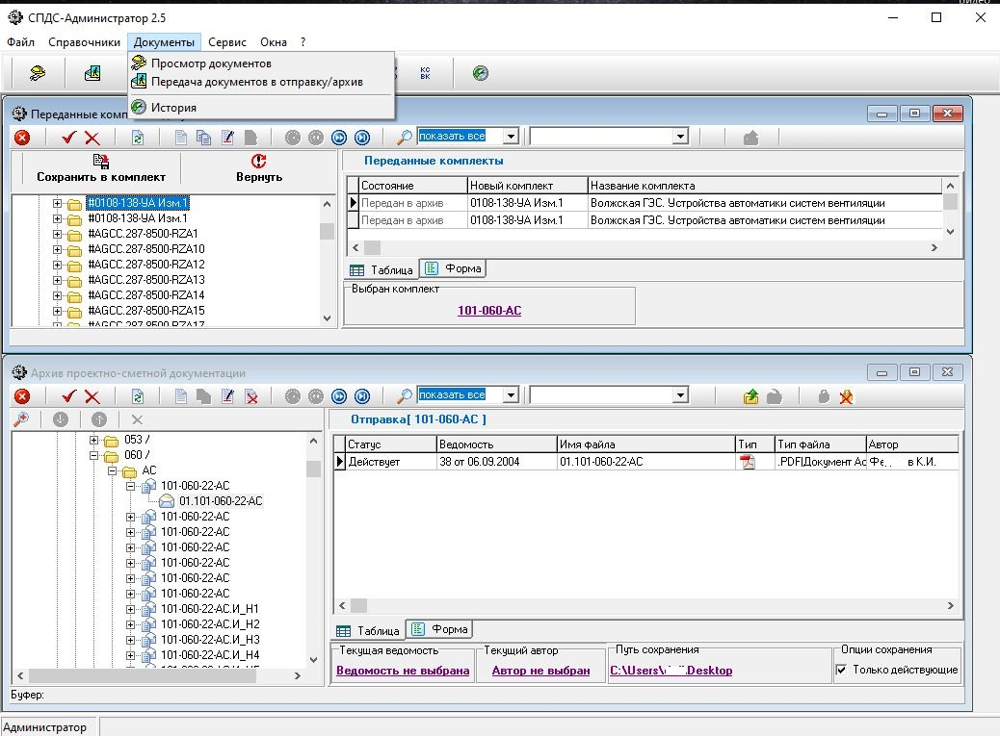
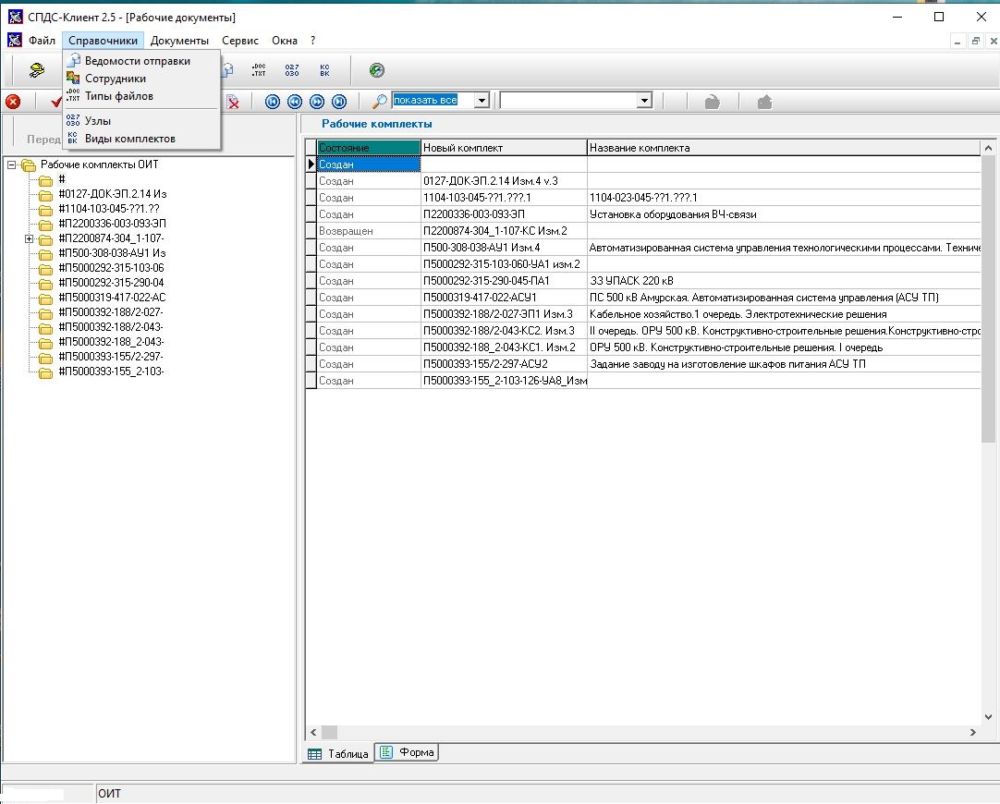

# SPDS
## Краткий обзор системы передачи и хранения проектно-сметной документации
## Общий вид. Рабочее место администратора.

## Общий вид. Рабочее место пользователя.

## Технологический стек:  
__SQL Firebid__: SQL система управления базами данных, клон Interbase, DDL(Data Definition Language) аналогичен Postgres.   
__Code Gear Delphi 2007__: гибкость, широкий функционал для обработки данных. Возможность использовать разнообразные библиотеки.      

Схема базы данных и связи таблиц приведены в файле [__spds-structure.pdf__](files/spds-structure.pdf)
Примеры определения таблиц: [__Complect__](./files/Complect.sql), [__Files__](files/Files.sql)  
Примеры определения хранимых процедур: [__FINDMARKS.sp__](files/FINDMARKS.sp), [__MOVEOPERCOMPLECT.sp__](files/__MOVEOPERCOMPLECT.sp)  
